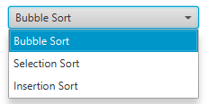
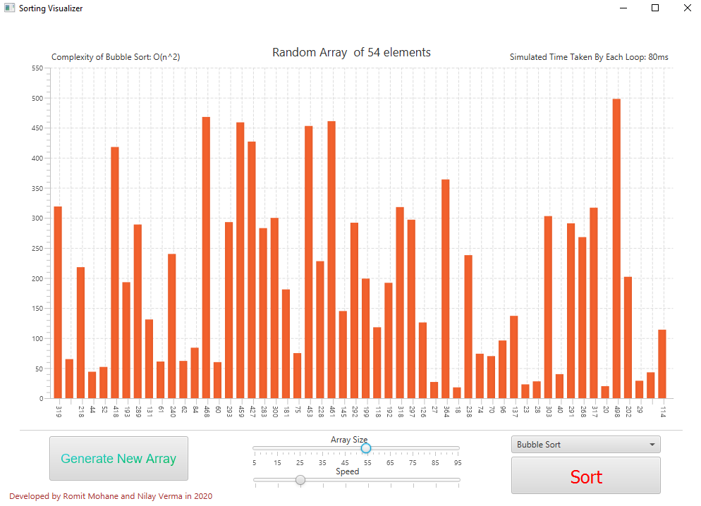
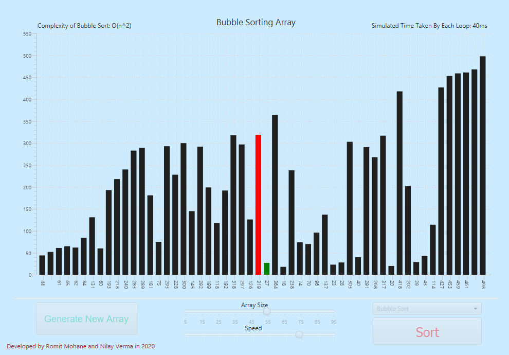
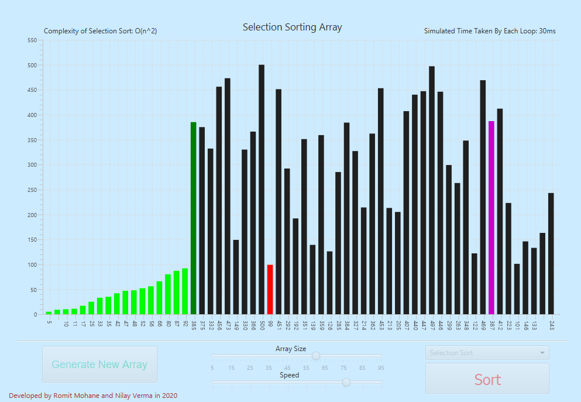
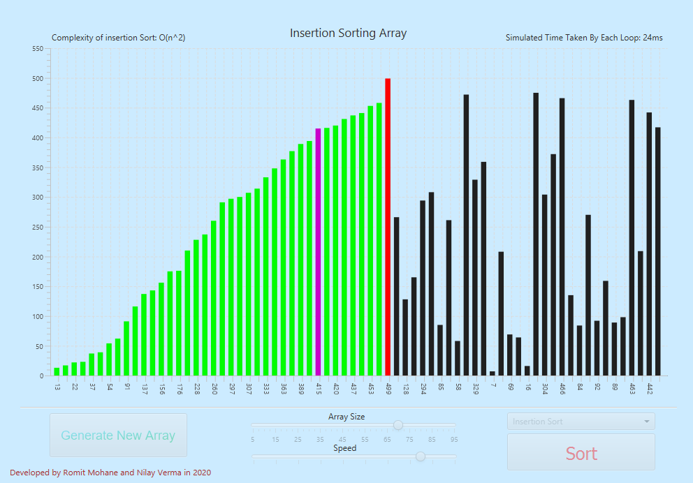

# Sorting Visualizer
JavaFX Sorting Visualizer 
⚡Visualising Sorting algorithms like Bubble Sort, Selection Sort and Insertion sort. 
🎯Intuitive and simple layout with sliders and buttons for easy control of size and speed. 

  ⏬Dropdown for Algorithms!   
<li>~~~~~~~~~~~~~~~~~~~~🖥UI~~~~~~~~~~~~~~~~~~~~~~</li>

   

